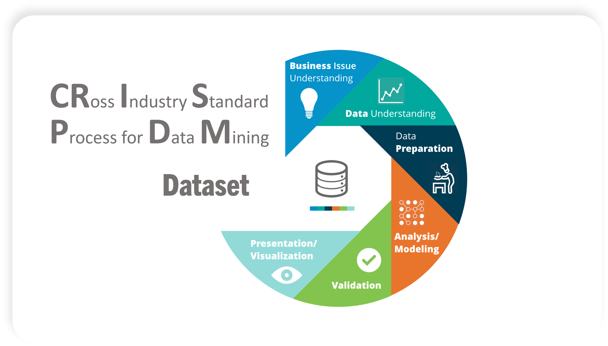

# 🏘️ Airbnb Price Prediction in Boston: A Dynamic Modeling Approach 📊

   
  Boston, Massachusetts, USA

    <!-- Project Links -->
    

## 📝 Description

This project applies predictive and dynamic modeling techniques to estimate the price of **[Airbnb](https://www.airbnb.com/)** listings in **Boston, MA**. By analyzing a rich dataset of property, host, and location characteristics, we aim to uncover the key drivers of pricing and build a robust regression model to predict listing prices.

## ✨ Objective

The key objectives of this project are to:

*   Develop a model for Airbnb listing prices in Boston.
*   Explore the relationships between various features and price.
*   Apply dynamic modeling techniques to improve prediction accuracy.
*   Provide insights relevant to hosts, potential investors, and the city government.

    

## 🎓 Project Context

This group project was developed for the **Introdução a Modelos Dinâmicos** (*Introduction to Dynamic Models*) course in the **[Licenciatura em Ciência de Dados](https://www.iscte-iul.pt/degree/code/0322/bachelor-degree-in-data-science)** (*Bachelor Degree in Data Science*) at **ISCTE-IUL**, during the 2022/2023 academic year (1st semester of the 2nd year).

## 🗺️ Data Source

The data for this project was sourced from **[Inside Airbnb](http://insideairbnb.com/get-the-data/)**, a non-commercial project that provides data on Airbnb listings worldwide.

*   **Dataset:** `listings.csv` for **Boston, MA** (dated September 15, 2022).
*   **Key Features:** `id`, `name`, `host_id`, `neighbourhood`, `room_type`, `price`, `minimum_nights`, `number_of_reviews`, `availability_365`, `license`, and more.

## ⚙️ Technologies Used

The project was developed primarily using the R ecosystem, with Power BI for the final dashboard visualization.

*   **[R](https://www.r-project.org/)**: The primary programming language and statistical computing environment.
*   **[RStudio](https://www.rstudio.com/)**: Integrated Development Environment (IDE) for R. 
    * *In addition, the models may also be tested on the "IRkernel"(Jupyter Notebook)*

    
    
    
    
    

*   **[Power BI](https://powerbi.microsoft.com/)**: for visualizing the results.
 

   

---

 

## 💻 Project Structure/Workflow

This project followed the **Cross-Industry Standard Process for Data Mining (CRISP-DM)** methodology.

    

1.  **Business Understanding:** 💡

    *   Explored a website to help understand the database with the meaning of its factors (ex: *Airbnb*).
    *   Defined the Core Problem: to predict the `price` of an Airbnb listing based on its characteristics.

2.  **Data Understanding:** 🔍

    *   Loaded and inspected the structure of the `listing.csv` datasets.
    *   Understood the meaning of each variables: the data is related on AirBnb for Boston in *15/September/2022*.
    *   **Exploratory Data Analysis (EDA):** Analyzed the distribution of variables, relationships between features, and potential patterns.
  

3.  **Data Preparation:** 🛠️
    
    *   **Data Cleaning:** Removed missing values, outliers, and irrelevant columns.
    *   **Feature Engineering:** Created new variables and transformed existing ones.
    *   **Data Transformation:** Normalized and standardized the data.

4.  **Modeling:** 🤖
   
    *   The goal was to study the **Price** by applying linear regression models with specific datasets and with supervisionated analysis.
    *  **Simple/ Multiple Linear Regression Assumptions:** 
        *   **Linearity:** The relationship between the independent and dependent variables is linear.
        *   **Independence:** Observations are independent of each other.
        *   **Homoscedasticity:** The variance of the residuals is constant across all levels of the independent variables.
        *   **Normality:** The residuals are normally distributed.
        *   **No Multicollinearity:** The independent variables are not highly correlated with each other.
    *   **Model Selection:** We tested different models and selected the best one based on performance metrics.
  

5.  **Evaluation:** ✅

    *   Show how many variables may have influence over the model, and tested some values and outliers.
    *   The model validation had two main points: in and out-sample data evaluation.
    *   **Model Evaluation Metrics:** 
        *   **Residual Error:** The difference between the predicted and actual values.
        *   **R-Squared ($R^2$):** The proportion of the variance in the dependent variable that is predictable from the independent variables.
        *   **AIC (Akaike Information Criterion):** A measure of the relative quality of a statistical model.
        *   **BIC (Bayesian Information Criterion):** A criterion for model selection among a finite set of models.
        *   **MAPE (Mean Absolute Percentage Error):** A measure of prediction accuracy. (*out-of-sample* and *in-sample*).

6.  **Deployment:** 🚀

    *   Developed the final report.
    *   Created a Power BI dashboard to visualize the results.
  
---

## 📊 Power BI Dashboard

A dashboard was created to visualize the final, cleaned dataset, allowing for interactive exploration of prices and listing counts across different Boston neighborhoods.

  

  
## 👥 Team Members (Group 2)

*   **André Silvestre** (Nº104532)
*   **Diogo Catarino** (Nº104745)
*   **Francisco Gomes** (Nº104944)
*   **Rita Matos** (Nº104936)

## 🇵🇹 Note

This project was developed using Portuguese from Portugal 🇵🇹.
